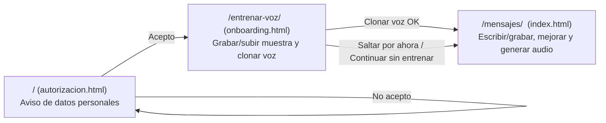

# Resumen Técnico — Líder Activo

> Documento de apoyo para la sustentación del proyecto de graduación. Resume la arquitectura, las APIs externas integradas, las decisiones de diseño y respuestas preparadas a preguntas frecuentes de tribunal (incluida la de "temperature").

## 1. Qué resuelve la app

**Líder Activo** ayuda a un líder de equipo a comunicar mejor sus mensajes: escribe o graba un mensaje corto, una IA de texto (OpenAI) lo redacta con mejor gramática/ortografía y en el tono elegido, y un servicio de voz (ElevenLabs) lo convierte en audio — opcionalmente con una **voz clonada del propio usuario**, para que el mensaje suene como si el líder lo hubiera grabado él mismo.

## 2. Stack tecnológico

| Capa | Tecnología |
|---|---|
| Backend | Django 6.1 (Python), sin modelos de negocio propios ni base de datos de negocio |
| Servidor de aplicación | Gunicorn (Railway) / función serverless WSGI (Vercel) |
| Archivos estáticos | WhiteNoise (sirve CSS/JS sin depender de Nginx ni de un CDN aparte) |
| Frontend | HTML + CSS + JavaScript vanilla — sin framework (React/Vue), sin bundler, sin build step |
| IA de texto | OpenAI API (`openai` SDK, v1+) |
| Voz (clonación y texto-a-voz) | ElevenLabs API (`elevenlabs` SDK, v1+) |
| Persistencia | Ninguna propia. El "estado" (voz activa) vive en `localStorage` del navegador; la única base de datos (SQLite) es la que usan internamente `django.contrib.admin`/`auth`/`sessions` |

**Por qué no hay base de datos propia:** la app no necesita guardar historial de mensajes ni cuentas de usuario — cada mensaje se procesa y se entrega al instante (texto + audio en la misma respuesta HTTP), y el catálogo de "voces del usuario" ya vive en la cuenta de ElevenLabs (se consulta en vivo con `listar-voces/`). Esto simplifica el despliegue (no hay migraciones de negocio, no hay backups de datos sensibles que proteger) y encaja con el hecho de que las muestras de voz son un **dato biométrico**: cuantos menos lugares se almacenen, menor la superficie de riesgo.

## 3. Arquitectura de pantallas

| Pantalla | URL | Plantilla | Responsabilidad |
|---|---|---|---|
| Autorización | `/` | `autorizacion.html` | Punto de entrada real de la app. Aviso de tratamiento de dato biométrico (Ley Orgánica de Protección de Datos Personales — LOPDP, Ecuador). Sin aceptar, no se puede continuar; el rechazo se resuelve en la misma pantalla (sin navegar) |
| Entrenar mi voz | `/entrenar-voz/` | `onboarding.html` | Grabar (con guion de lectura sugerido) o subir un archivo de audio (1–3min) y clonarlo con ElevenLabs (Instant Voice Cloning). Se puede saltar sin entrenar |
| Mensajes | `/mensajes/` | `index.html` | Pantalla principal: escribir o grabar un mensaje, elegir tono/idioma/voz, mejorarlo con IA y generar el audio final. Gestiona también "Mis voces" (listar/usar/eliminar) |

Cada pantalla es un documento HTML independiente (arquitectura *multi-page application*, no *SPA*): no hay enrutador de JavaScript ni estado compartido entre pantallas más allá de `localStorage` (para recordar la voz activa) y la navegación completa del navegador entre URLs.

## 4. Endpoints (`voiceapp/voiceapp/urls.py`)

| Método | Ruta | Vista | Qué hace |
|---|---|---|---|
| GET | `/` | `autorizacion` | Renderiza la pantalla de autorización |
| GET | `/entrenar-voz/` | `onboarding` | Renderiza la pantalla de clonación de voz |
| GET | `/mensajes/` | `index` | Renderiza la pantalla principal |
| POST | `/procesar-texto/` | `procesar_texto` | Recibe texto escrito → GPT lo mejora → ElevenLabs genera el audio |
| POST | `/procesar-audio/` | `procesar_audio` | Recibe un audio grabado → Whisper lo transcribe → GPT lo mejora → ElevenLabs genera el audio |
| POST | `/clonar-voz/` | `entrenar_voz` | Recibe la(s) muestra(s) de audio → ElevenLabs crea la voz clonada (Instant Voice Cloning) |
| GET | `/listar-voces/` | `listar_voces` | Devuelve las voces disponibles en la cuenta de ElevenLabs (propias + de stock) |
| POST | `/eliminar-voz/` | `eliminar_voz` | Elimina una voz clonada de la cuenta de ElevenLabs |
| POST | `/enviar-teams/` | `enviar_teams` | Reenvía un mensaje ya mejorado a un canal de Microsoft Teams, a través del webhook que el propio usuario configuró |

Toda la lógica de negocio (llamadas a OpenAI/ElevenLabs, validaciones) vive exclusivamente en `voiceapp/voiceapp/views.py`; las plantillas HTML no contienen lógica de servidor.

## 5. Integración con APIs externas

### 5.1 OpenAI

| Servicio | Modelo | Función en el código | Para qué se usa |
|---|---|---|---|
| Chat Completions | `gpt-4o-mini` | `mejorar_texto()` | Corrige gramática/ortografía/sintaxis y ajusta el tono (profesional, motivador, directo, empático) del mensaje, sin inventar contenido ni convertirlo en carta formal |
| Transcripción (Whisper) | `whisper-1` | `procesar_audio()` | Convierte el audio grabado por el usuario en texto, antes de mejorarlo |
| Moderación | `omni-moderation-latest` | `verificar_contenido_prohibido()` | Filtra insultos, amenazas o extorsión antes de mejorar el texto o de nombrar una voz clonada |

El **prompt del sistema** de `mejorar_texto()` está escrito siguiendo la guía oficial de prompt engineering de OpenAI (estructura por secciones en Markdown: *Identidad → Instrucciones → Formato de salida*), e incluye reglas explícitas para: entender la intención del mensaje, corregir errores, notar el tono elegido, **no inventar destinatarios, cargos ni placeholders** (`[Nombre]`, `[Cargo]`, etc.), y sonar natural para leerse en voz alta (no como un correo formal).

### 5.2 ElevenLabs

| Servicio | Función en el código | Para qué se usa |
|---|---|---|
| Instant Voice Cloning (IVC) | `entrenar_voz()` | Crea una voz clonada a partir de una muestra de audio de 1–3min, con `remove_background_noise=True` (limpia ruido de fondo antes de entrenar) |
| Text-to-Speech | `texto_a_audio()` | Convierte el texto ya mejorado en un archivo de audio (MP3), con la voz clonada del usuario o la voz por defecto de la cuenta |
| Voices (listar/eliminar) | `listar_voces()`, `eliminar_voz()` | Gestiona el catálogo de voces de la cuenta (no hay tabla propia: ElevenLabs es la fuente de verdad) |

**Nota importante:** esta app usa **Whisper (OpenAI)** para transcribir audio, no el servicio de Speech-to-Text de ElevenLabs — son dos proveedores distintos para dos tareas distintas (transcripción vs. síntesis/clonación de voz).

### 5.3 Historial de mensajes (solo en el navegador)

La pestaña "Historial" de Mensajes guarda los últimos 30 mensajes mejorados (texto original, texto mejorado, tono e idioma) en `localStorage`, **no en el servidor**: coherente con la decisión de no tener base de datos de negocio (sección 2). El audio no se persiste (evita inflar `localStorage` con base64 y no duplica un dato sensible más de lo necesario). Permite "Reutilizar" un mensaje anterior (lo recarga en el compositor de texto) o eliminarlo.

### 5.4 Integración con Microsoft Teams

Permite enviar el mensaje ya mejorado directamente a un canal de Teams, a través de un **Incoming Webhook** que el propio usuario crea desde su canal (Teams: *canal → "⋯" → Workflows → plantilla "Send webhook alerts to a channel"*; es el mecanismo vigente — Microsoft retiró en 2026 los antiguos "Office 365 Connectors"). La URL del webhook se guarda en `localStorage`, igual que el resto de preferencias del usuario.

**Por qué el envío pasa por el backend (`enviar_teams()`) y no se llama directo desde el navegador:** el webhook de Teams no responde con cabeceras CORS para peticiones desde otro origen, así que un `fetch()` directo desde JavaScript sería bloqueado por el navegador. El servidor hace esa llamada por su cuenta con la librería `requests` (sin restricción CORS, porque CORS es una regla que solo aplica a peticiones iniciadas por un navegador).

**Por qué se valida el dominio de la URL en el servidor:** al ser un endpoint público (`/enviar-teams/`), sin esa validación cualquiera podría mandarle una URL arbitraria y usar el servidor como *proxy* para reenviar peticiones HTTP a donde quiera (un riesgo de *SSRF — Server-Side Request Forgery*). `enviar_teams()` solo reenvía el mensaje si el host de la URL termina en un dominio real de Microsoft (`logic.azure.com`, `powerautomate.com`, `powerplatform.com`, `flow.microsoft.com`, o el legado `webhook.office.com`).

## 6. Parámetros clave — "temperature" (pregunta frecuente)

Esta es una pregunta natural del tribunal porque **"temperature" existe en OpenAI pero no en la parte de ElevenLabs que usa esta app.** Vale la pena tenerlo claro:

### 6.1 `temperature` en OpenAI (Chat Completions)

- Es un hiperparámetro de muestreo: controla qué tan aleatoria es la elección del siguiente token (palabra/fragmento) al generar texto.
- Rango en la API: **0 a 2**.
  - **`temperature = 0`** → el modelo casi siempre elige la palabra de mayor probabilidad → salida más determinística y repetible (misma entrada tiende a dar la misma salida).
  - **`temperature` alta (ej. 1.5–2)** → más aleatoriedad/diversidad → respuestas más "creativas" pero menos predecibles y con más riesgo de desviarse del pedido.
- **En este proyecto:** `mejorar_texto()` usa `temperature=0.7` — un valor medio que deja que el tono elegido (motivador, empático, etc.) se note en el vocabulario y la construcción de las frases, sin volverse errático ni inventar contenido (eso último lo controla el *prompt*, no la temperatura).
- Importante aclarar en la defensa: la temperatura **no decide qué tanto cambia el texto** (esa es tarea de las instrucciones del prompt) — decide **qué tan aleatoria es la generación en sí**, por lo que dos llamadas con el mismo texto de entrada pueden dar salidas ligeramente distintas.

### 6.2 ¿"Temperature" en ElevenLabs?

**El endpoint de Text-to-Speech de ElevenLabs (el que usa esta app) no tiene un parámetro llamado `temperature`.** El concepto equivalente ahí es un objeto llamado **`voice_settings`**, con otros parámetros:

| Parámetro | Rango | Qué controla |
|---|---|---|
| `stability` | 0–1 | Qué tan estable/consistente suena la voz entre generaciones. **Es el más parecido conceptualmente a "temperature", pero invertido**: estabilidad *baja* = más variación/expresividad (más "aleatorio"); estabilidad *alta* = voz más monótona pero más consistente |
| `similarity_boost` | 0–1 | Qué tanto prioriza el modelo sonar exactamente como la voz clonada original |
| `style` | 0–1 | Exageración del estilo/expresividad de la voz |
| `use_speaker_boost` | booleano | Refuerzo computacional extra de fidelidad al hablante (más costo/latencia a cambio de más parecido) |
| `speed` | ~0.7–1.2 | Velocidad de habla |

**En este proyecto:** `texto_a_audio()` usa `stability=0.5`, `similarity_boost=0.9`, `style=0.0`, `use_speaker_boost=True` — valores elegidos para priorizar el parecido con la voz clonada real por sobre la expresividad (ver sección 7).

**Dato para citar si preguntan específicamente por la palabra "temperature" en ElevenLabs:** sí existe, pero en un servicio distinto de su plataforma — su **Speech-to-Text** (transcripción, llamado "Scribe") — que **esta app no usa** (para transcribir se usa Whisper de OpenAI). Por eso puede generar confusión: "temperature" es un término real del ecosistema ElevenLabs, pero no del servicio que este proyecto integra (clonación de voz + texto-a-voz).

## 7. Ajustes para mejorar la fidelidad del clon de voz

La documentación de ElevenLabs para Instant Voice Cloning no publica un guion de texto fijo a leer; recomienda sobre todo **audio limpio, sin ruido, con tono/ritmo consistente**, y advierte que pasados ~3 minutos el beneficio adicional es mínimo (por eso el límite de la app es 1–3min, no más). En base a eso:

- `remove_background_noise=True` al crear la voz (limpia ruido de habitación/eco antes de entrenar).
- `voice_settings` afinados para favorecer el parecido con la voz real (`similarity_boost=0.9`, `use_speaker_boost=True`) por sobre la expresividad.
- Un **guion sugerido** de 6 párrafos (afirmaciones, preguntas, exclamaciones, números, sonidos variados como "rr"/"ll"/"ñ") para que la muestra cubra una gama más amplia de la voz del usuario que si repitiera siempre el mismo patrón — presentado como sugerencia opcional, colapsado por defecto.

## 8. Seguridad, privacidad y moderación

- **Dato biométrico:** la muestra de voz se trata como tal. Antes de poder usar la app, la pantalla de autorización exige aceptar el tratamiento de ese dato (LOPDP Ecuador); si se rechaza, no hay forma de continuar.
- **Filtro de contenido (`verificar_contenido_prohibido`):** combina (1) una lista local de insultos/frases de amenaza-extorsión en español (rápida, sin costo, funciona aunque la API falle) y (2) la API de Moderación de OpenAI (`omni-moderation-latest`), para evitar que la clonación de voz se use para hacerse pasar por otra persona con fines de extorsión o insultos. Se aplica antes de mandar el texto a GPT y antes de nombrar una voz clonada.
- **CSRF:** los endpoints POST usan `@csrf_exempt` porque son llamados vía `fetch()` desde JavaScript del mismo origen sin formulario tradicional de Django (no hay cookies de sesión de usuario involucradas en la lógica de negocio).
- **Claves de API:** se leen desde variables de entorno (`OPENAI_API_KEY`, `ELEVENLABS_API_KEY`), nunca hardcodeadas ni versionadas en el repositorio (`.env` está en `.gitignore`).

## 9. Despliegue

| Proveedor | Cómo corre |
|---|---|
| Railway | Servidor persistente con Gunicorn; WhiteNoise sirve los estáticos directamente |
| Vercel | Función serverless (`api/index.py`, adaptador WSGI); sin paso de `collectstatic`, WhiteNoise sirve los estáticos con `WHITENOISE_USE_FINDERS=True` |

## 10. Preguntas frecuentes que podría hacer el tribunal

**¿Por qué Django y no un framework más liviano (Flask/FastAPI)?**
Django trae de fábrica protección CSRF, manejo de archivos estáticos, y una estructura clara de vistas/URLs que alcanza para una app de este tamaño sin necesitar piezas adicionales; no se usó Django REST Framework porque los endpoints son pocos y simples (JSON de entrada/salida directo con `JsonResponse`).

**¿Por qué no hay base de datos de negocio?**
Cada mensaje se procesa y entrega en la misma petición HTTP (no hay historial que consultar después), y el catálogo de voces ya vive en ElevenLabs. Guardar copias de datos biométricos o de mensajes sin necesidad real aumentaría el riesgo de privacidad sin aportar valor al usuario.

**¿Qué pasa si el usuario no acepta el aviso de datos?**
Se queda en la misma pantalla (`/`, `autorizacion.html`) mostrando que no puede continuar, con opción de "Intentar de nuevo". No hay manera de llegar a clonar una voz sin aceptar.

**¿Se puede usar la app sin clonar una voz?**
Sí: en "Entrenar mi voz" existe la opción de saltar ("Saltar por ahora" / "Continuar sin entrenar"), y en ese caso los mensajes se generan con la voz por defecto de la cuenta de ElevenLabs (`ELEVENLABS_VOICE_ID`).

**¿Cómo se evita que la IA "invente" contenido al mejorar un mensaje?**
El prompt de sistema de `mejorar_texto()` prohíbe explícitamente agregar datos, peticiones, destinatarios o placeholders que el usuario no haya escrito, y pide devolver solo el mensaje final. Se verificó con pruebas manuales comparando el texto original contra varias salidas con distintos tonos.

**¿Qué pasa si alguien intenta usar la clonación de voz para extorsionar o insultar?**
`verificar_contenido_prohibido()` bloquea el mensaje (o el nombre de la voz) antes de procesarlo, combinando una lista local de palabras/frases con la API de Moderación de OpenAI.

**¿Qué formatos de audio soporta la grabación/subida, y por qué?**
WAV, MP3, M4A y WebM. Se agregó soporte a M4A específicamente porque los iPhone graban en ese formato; además se corrigió un bug donde el navegador etiquetaba el audio grabado como "webm" aunque el códec real fuera otro (como en iPhone/Safari, que graba en MP4), lo que rompía la reproducción de verificación y podía afectar la transcripción.

**¿Cómo se garantiza que la voz generada en "Mensajes" respete la voz clonada elegida?**
`texto_a_audio()` recibe explícitamente el `voice_id` seleccionado por el usuario (o `None` para la voz por defecto) y lo pasa a la llamada de ElevenLabs; se corrigió un bug donde el flujo de audio grabado no estaba leyendo ese `voice_id` del formulario y siempre usaba la voz por defecto.

---
*Generado como apoyo para la sustentación del proyecto de graduación "Líder Activo" — Ingeniería en Software.*
